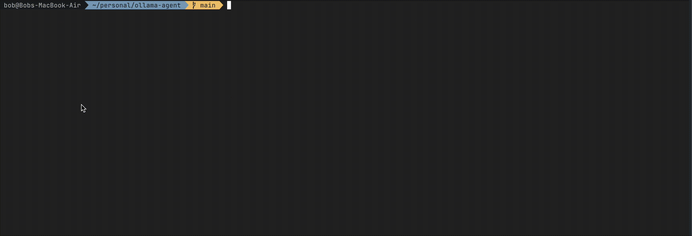

# GoLlama

A Go client for seamless interaction with Ollama models, providing a clean interface to build Ollama-powered applications.

Inspired by: https://ampcode.com/how-to-build-an-agent

## Demo 



## Features

- Simple, idiomatic Go interface to Ollama models
- Support for chat-based interactions
- Function/tool calling capabilities

## Build 

```bash
make build
```

## Installation

```bash
go get github.com/bobmaertz/ollama-agent
```

## Usage

GoLlama provides a simple command-line interface to interact with Ollama models:

```bash
gollama [options] chat
```

### Options

- `-u, -url` - The URL of the Ollama server (default: http://localhost:11434/api/chat)
- `-m, -model` - The model to use; must be installed (default: mistral:7b)

### Examples

Start a chat session with default settings:
```bash
gollama chat
```

Use a specific model:
```bash
gollama -m llama3 chat
```

Connect to a remote Ollama server:
```bash
gollama -u http://ollama-server:11434/api/chat chat
```

## Running from Source

```bash
gollama chat
```

With custom options:
```bash
gollama -m llama3 -u http://localhost:11434/api/chat chat
```